# PostgreSQL conference Germany 2025

On this conference I had 3 different talks:

- Building a Data Lakehouse with PostgreSQL: Dive into Formats, Tools, Techniques, and Strategies
- PostgreSQL Connections Memory Usage: How Much, Why and When? OnDebian/Ubuntu-x86-64architecture
- Your Data Deserves the Best: Migration to PostgreSQL

## Photos

<a href="1000009151.jpg">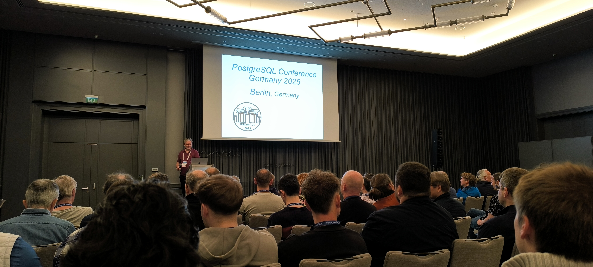</a>
<a href="1000009152.jpg">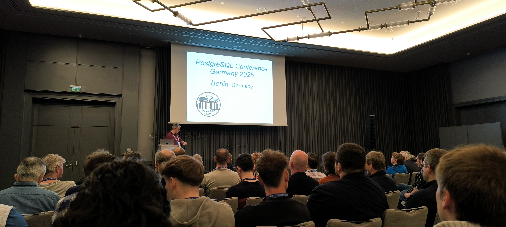</a>
<a href="1000009154.jpg">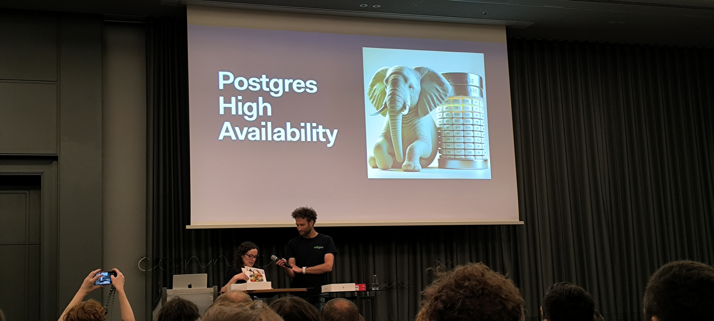</a>
<a href="1000009155.jpg">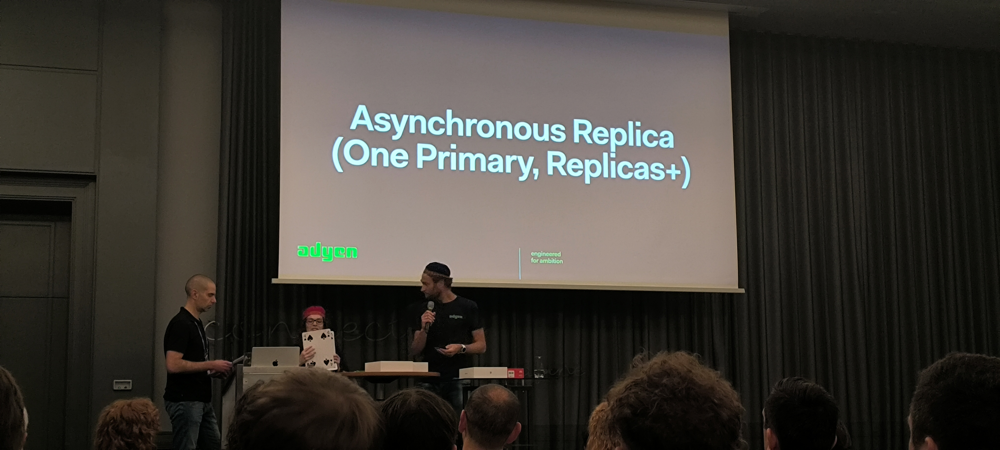</a>
<a href="1746687138095.jpeg">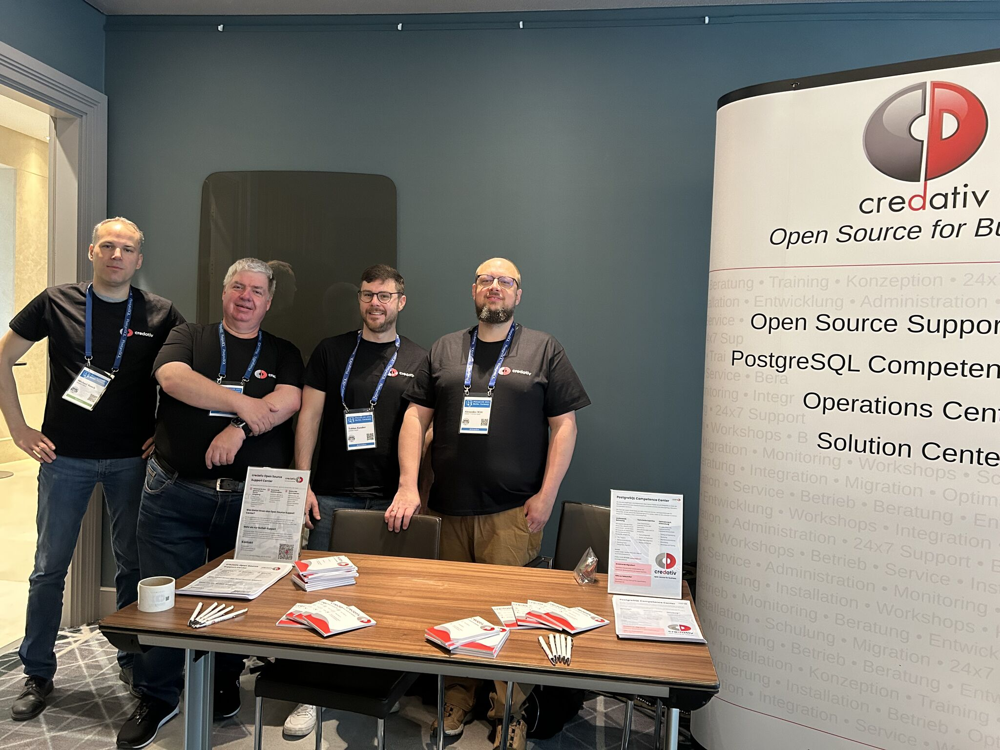</a>
<a href="1746687138664.jpeg">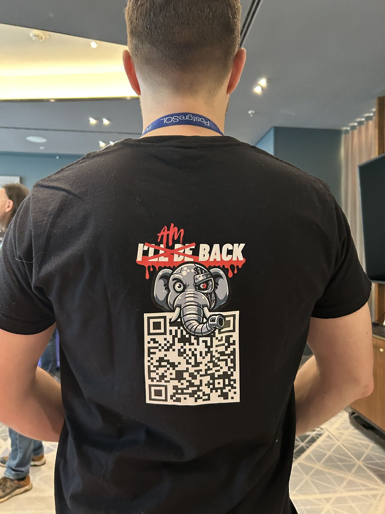</a>
<a href="1746749384303.jpeg">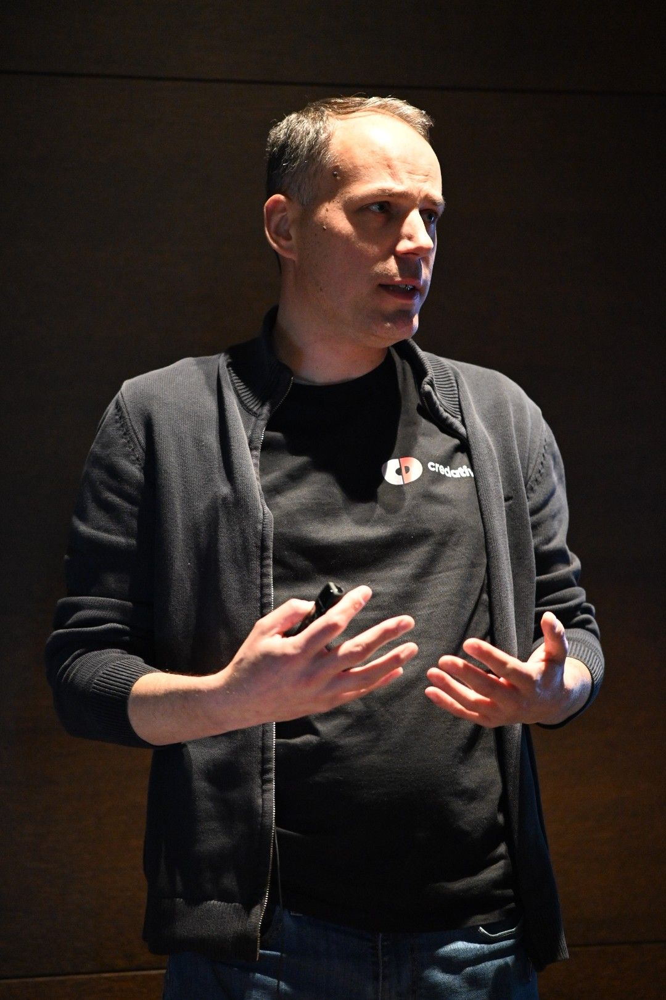</a>
<a href="1746788839909.jpeg">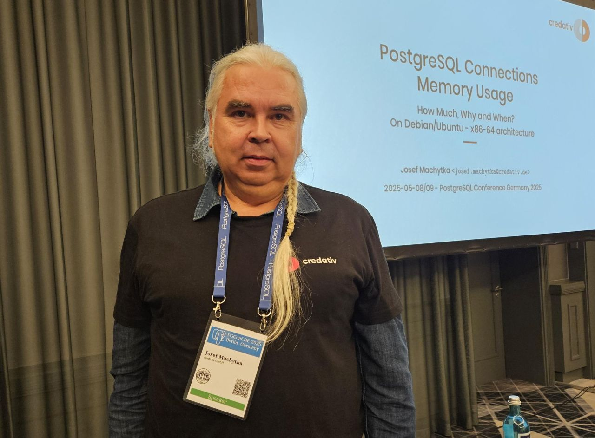</a>
<a href="1746804901060.jpeg">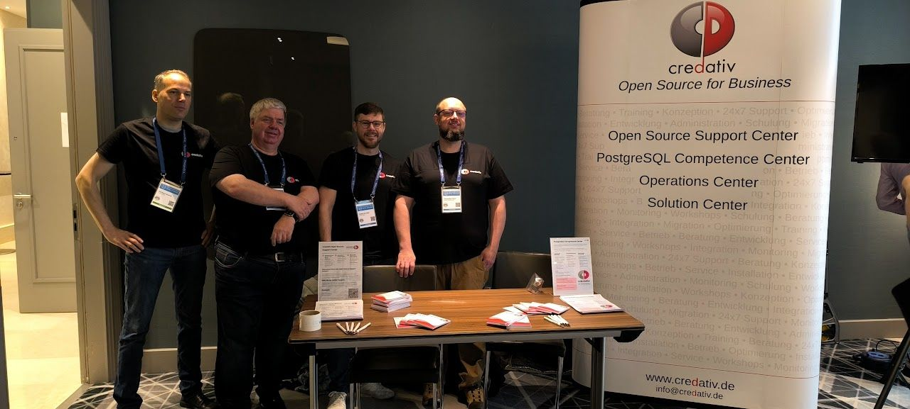</a>
<a href="1746804901118.jpeg">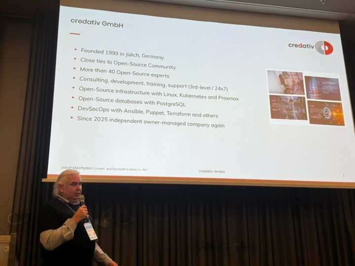</a>
<a href="1746804901201.jpeg">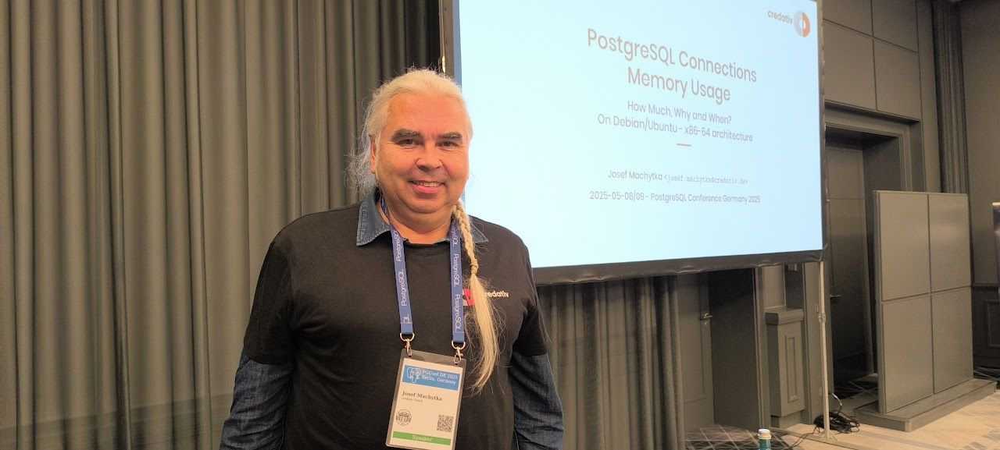</a>
<a href="2025-05-08-15-36-12-282.jpg">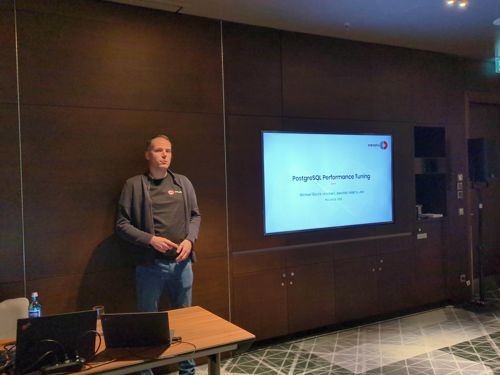</a>
<a href="2025-05-09-12-31-11-018.jpg">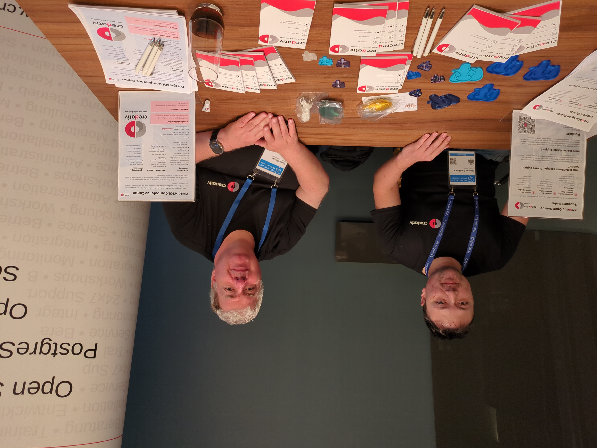</a>
<a href="pgconfde-memory-talk-feedback.png">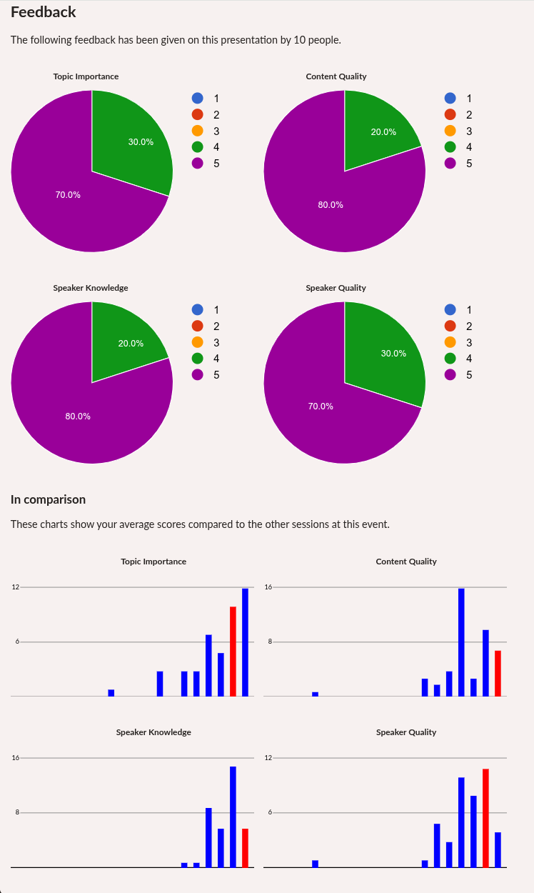</a>
<a href="pgconfde2025-datalakehouse-talk-feedback.png">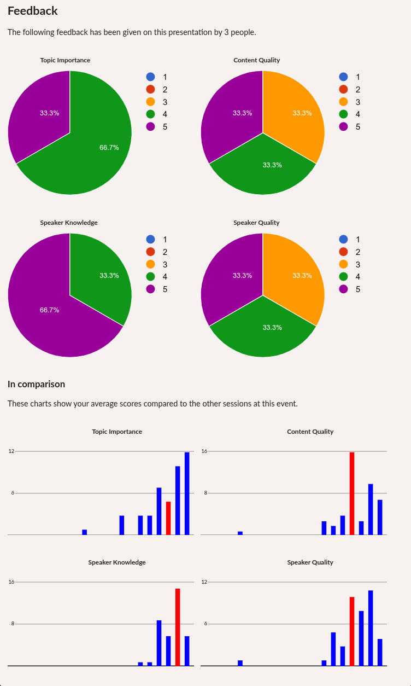</a>

