# PostgreSQL Conference Europe 2025

https://2025.pgconf.eu/

My talks at PostgreSQL Conference Europe 2025:

[Database in Distress: Testing and Repairing Different Types of Database Corruption](https://www.postgresql.eu/events/pgconfeu2025/schedule/session/6825-database-in-distress-testing-and-repairing-different-types-of-database-corruption/) - Friday, October 24 at 14:55–15:45

## Photos

<a href="1761395238889.jpeg">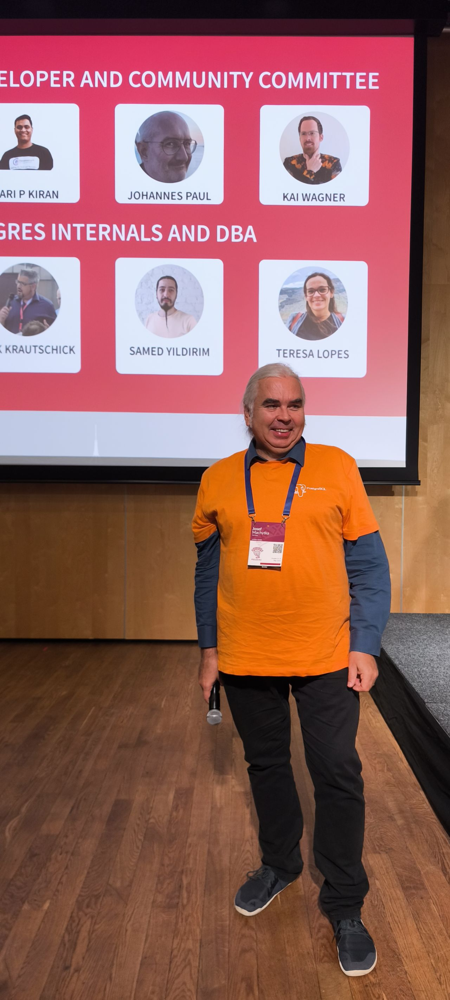</a>
<a href="58341585539311a8.jpeg">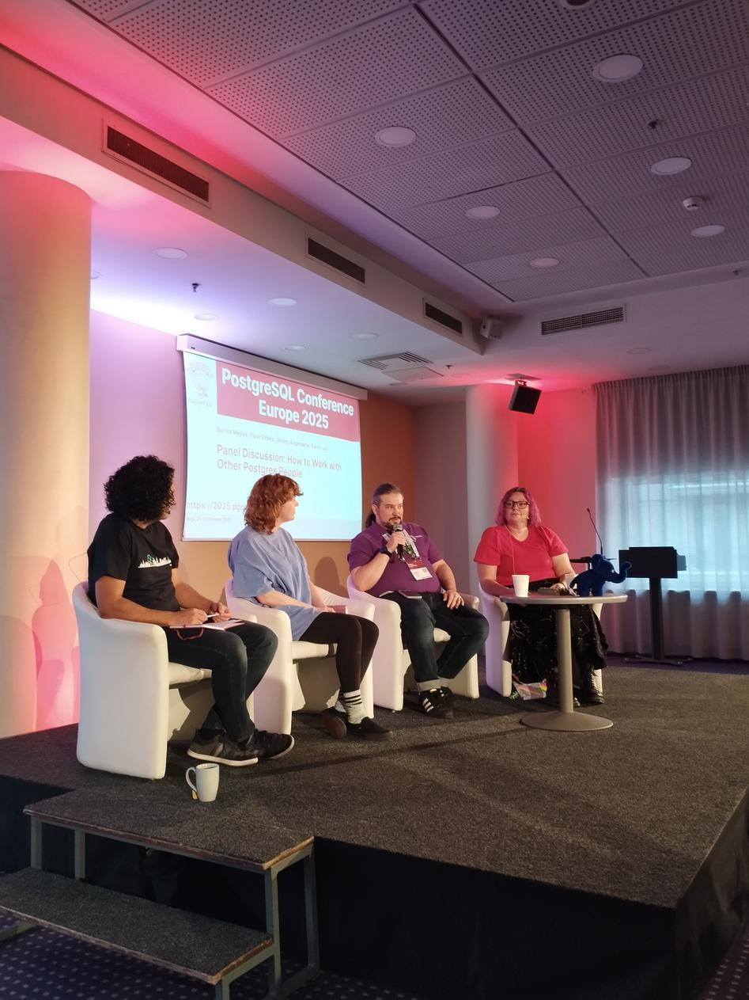</a>
<a href="5d84ea51f1cc9434.jpeg">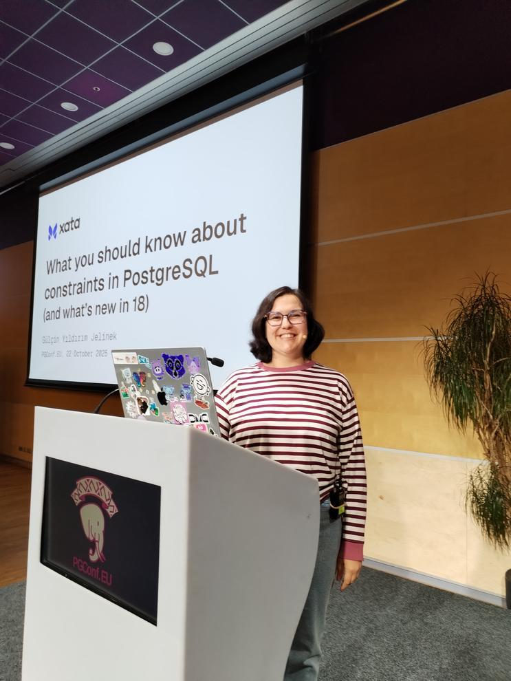</a>
<a href="66b55374db5e53e7.jpeg">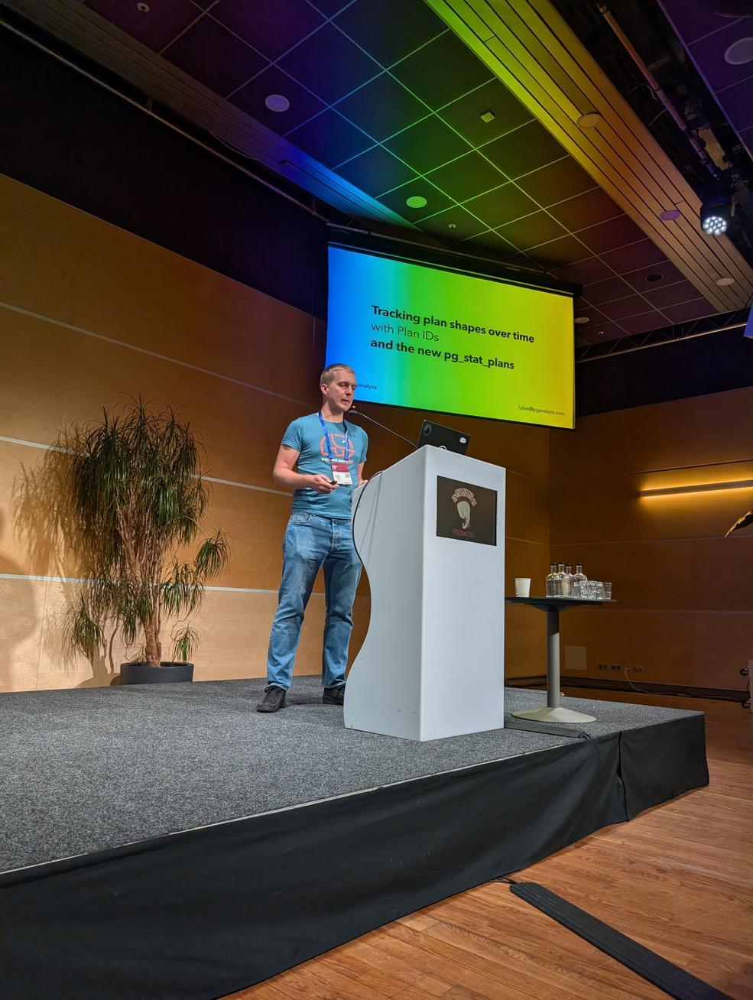</a>
<a href="7dd5f3a3fd07058c.png">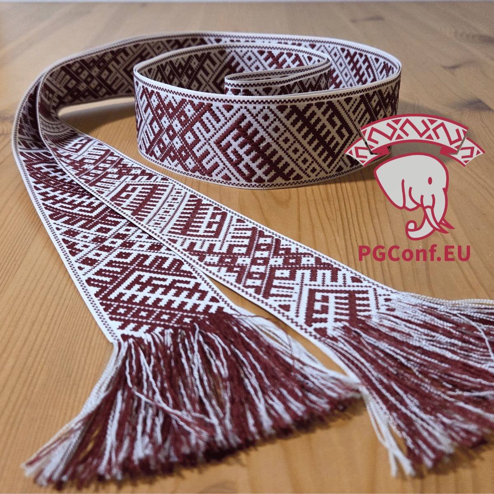</a>
<a href="82bf5e1e32f3013c.jpeg">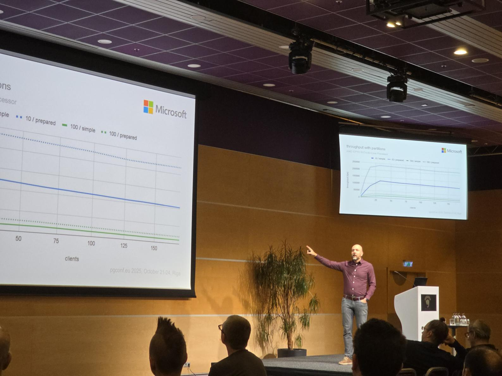</a>
<a href="8c1b66858adf65af.jpeg">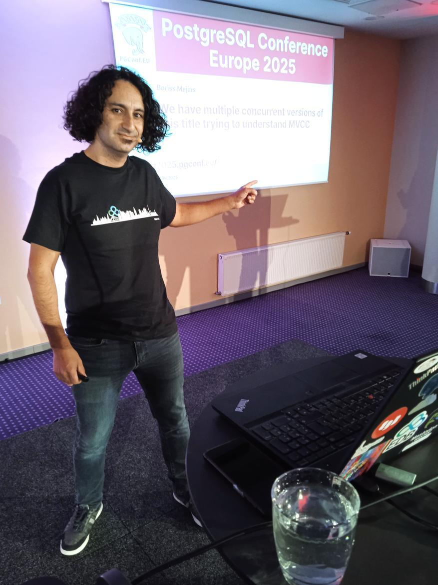</a>
<a href="9305851bd684e866.jpeg">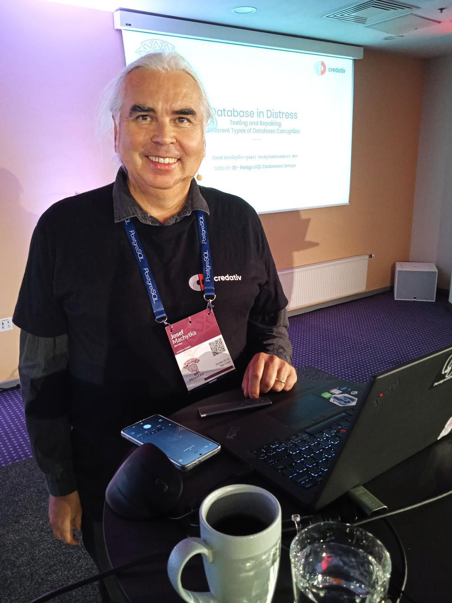</a>
<a href="BE27AAD1-BEDB-44E5-8490-8494E2B8DE37.jpg">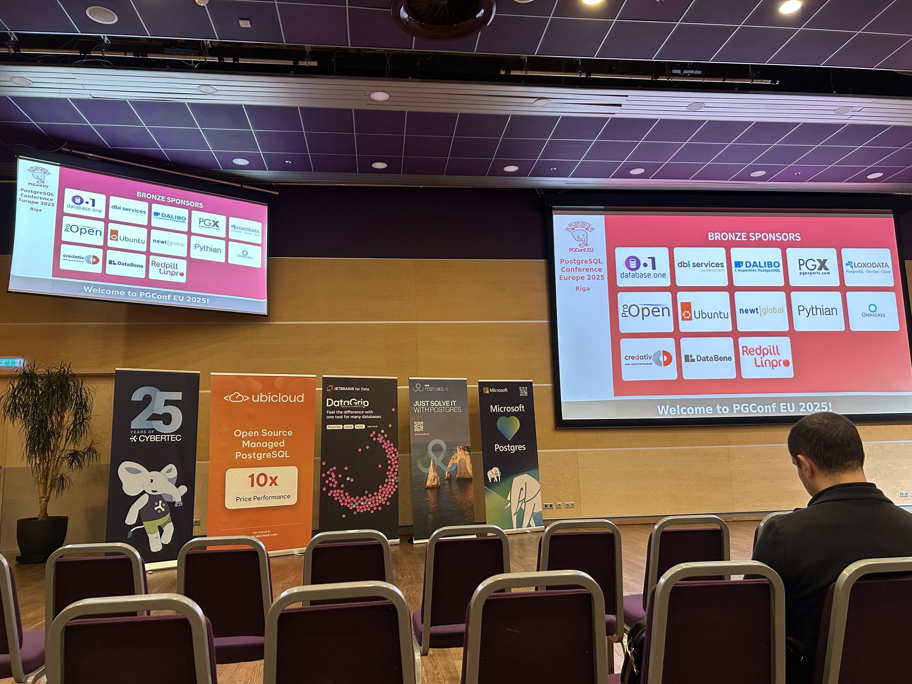</a>
<a href="C41F1236-27ED-4E70-B05B-6B795AFC223D.jpg">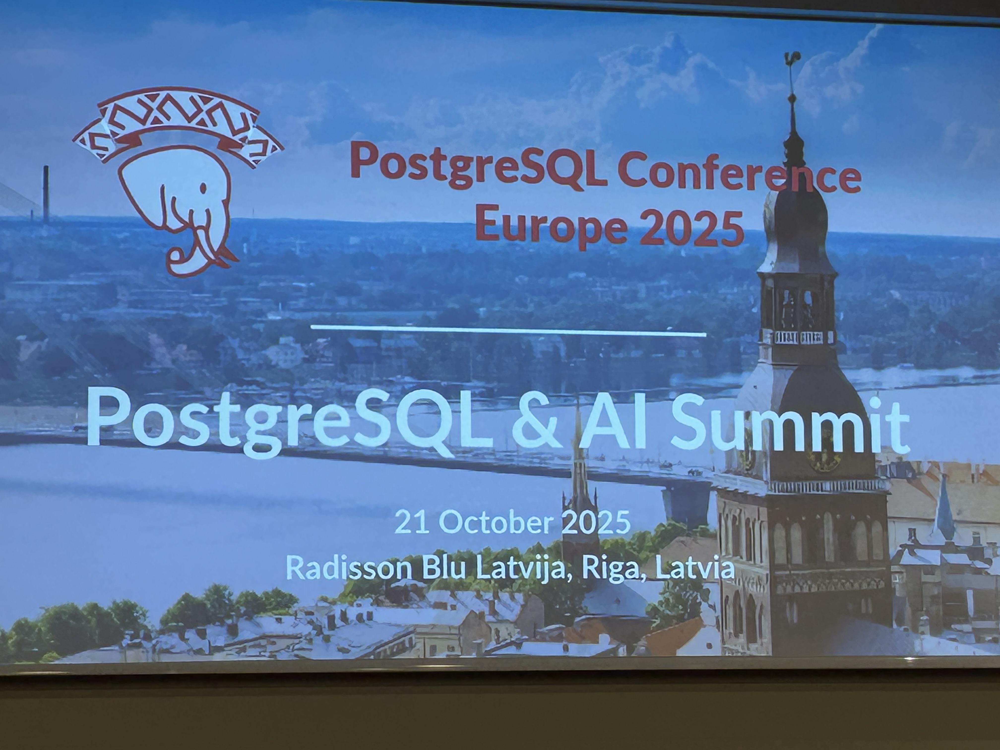</a>
<a href="IMG_20251024_102438.jpg">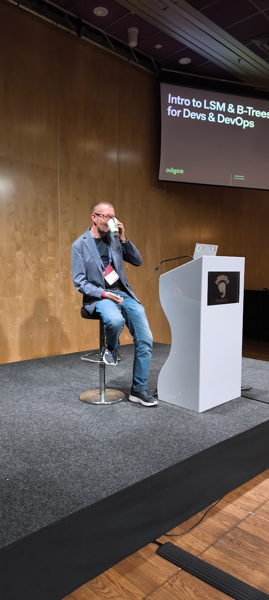</a>
<a href="IMG_20251024_104342.jpg">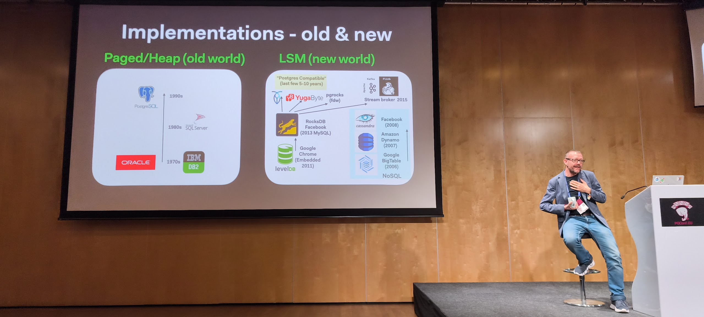</a>
<a href="c87ca70eb8b5d376.jpeg">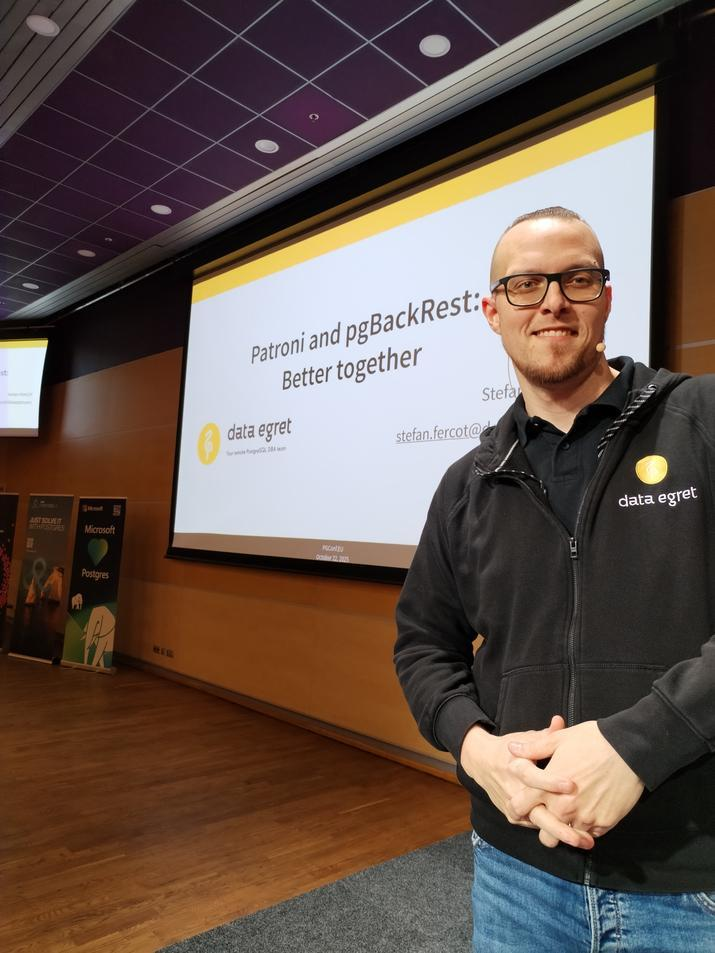</a>
<a href="cdcff4cc53d2cce0.jpeg">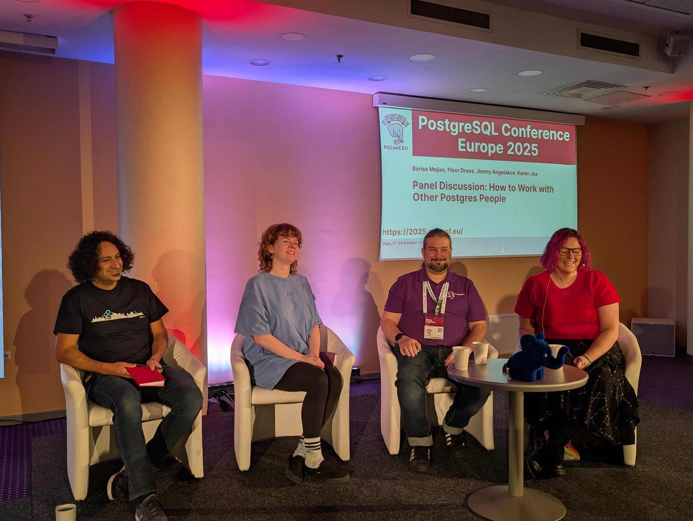</a>
<a href="rn_image_picker_lib_temp_b32edfcb-2a3c-4f6f-a68c-d0216c436339.jpg">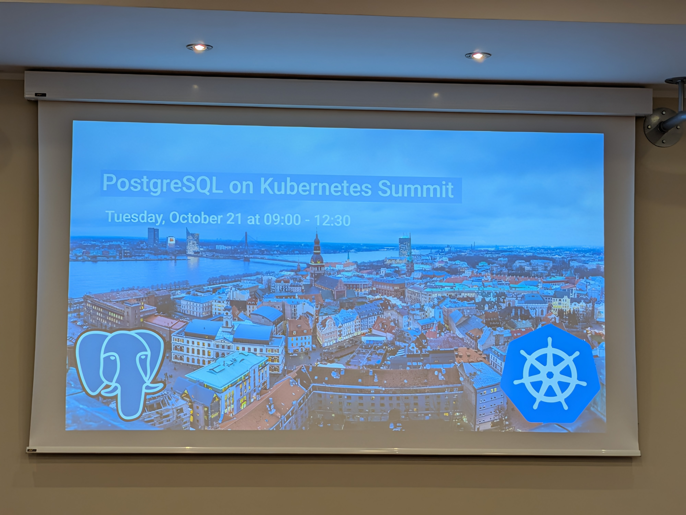</a>

