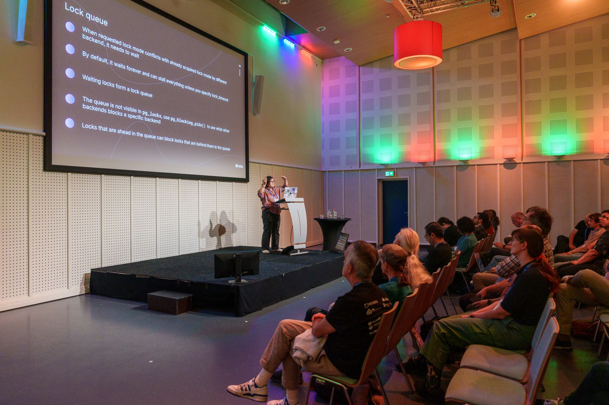
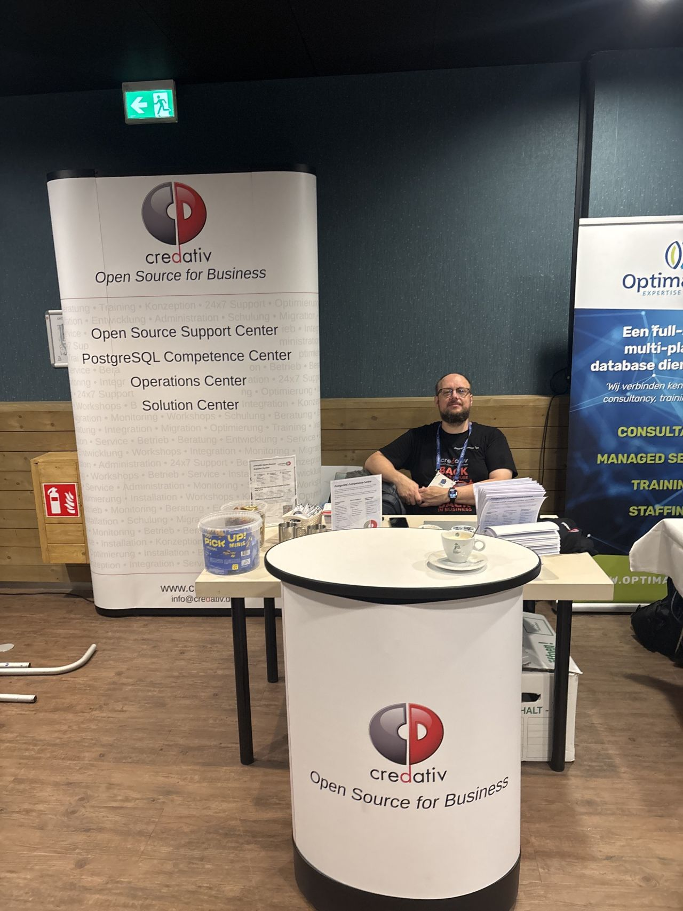
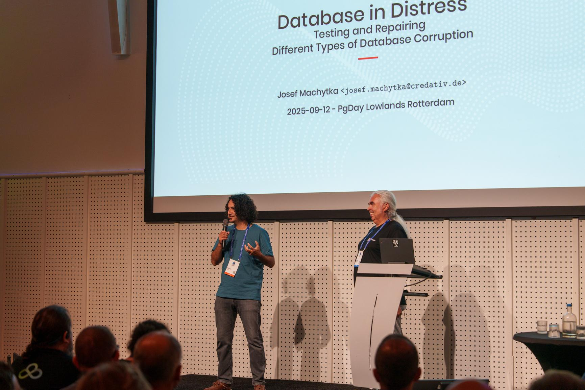
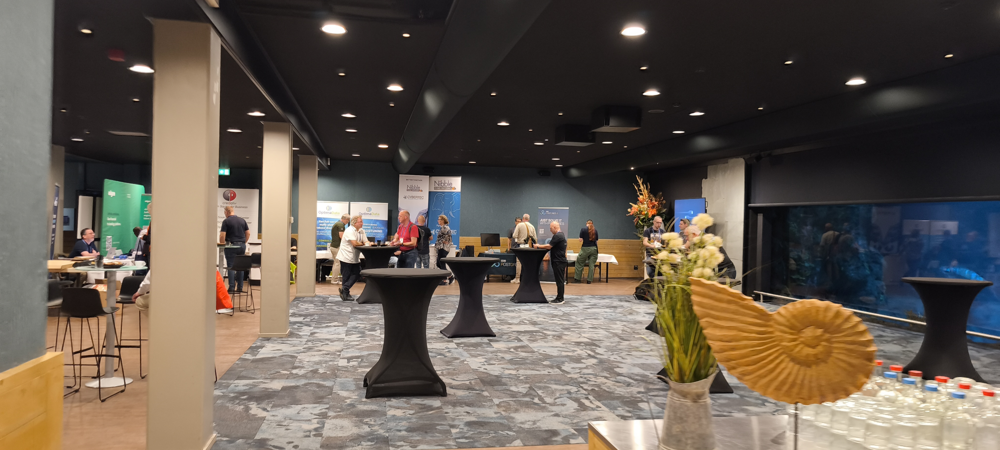
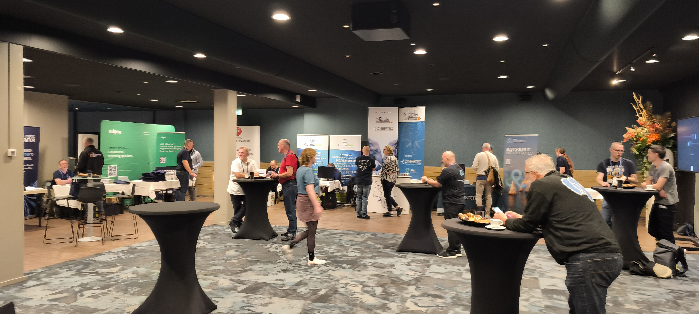
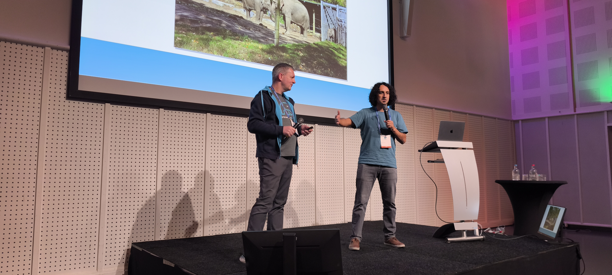
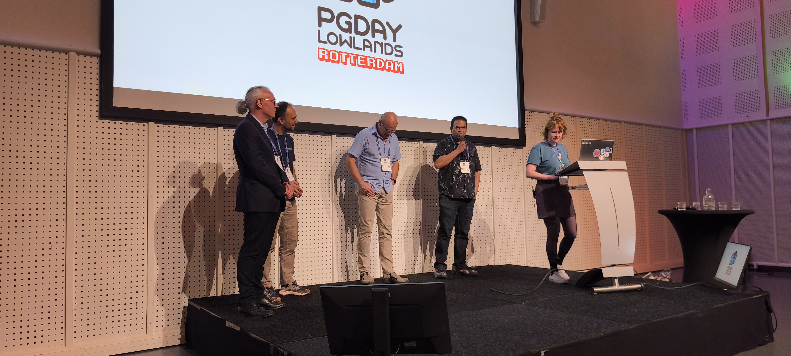

# PGDy Lowlands 2025 - September 12th

https://2025.pgday.nl/

https://www.postgresql.eu/events/pgdaynl2025/schedule/

Talk: Database in Distress: Testing and Repairing Different Types of Database Corruption

## Photos

