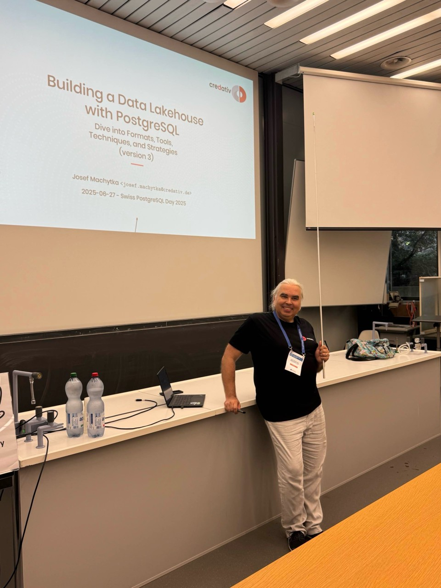
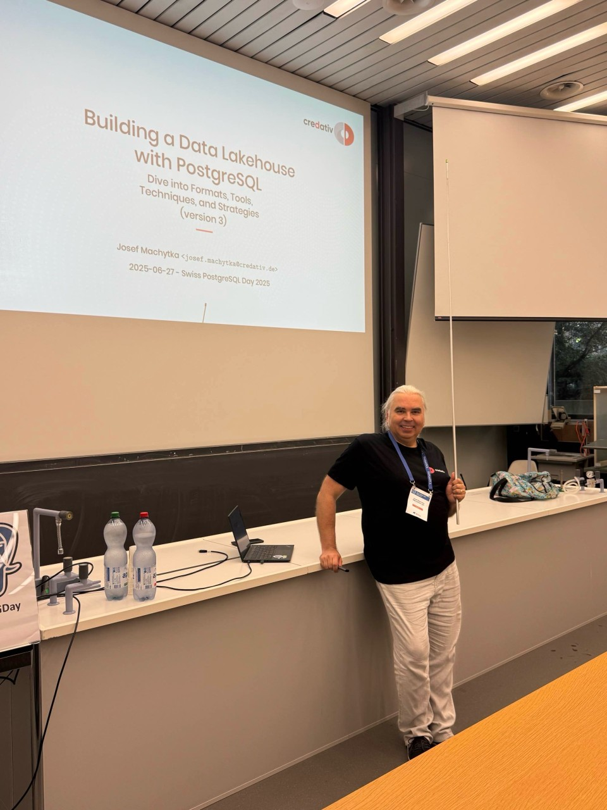
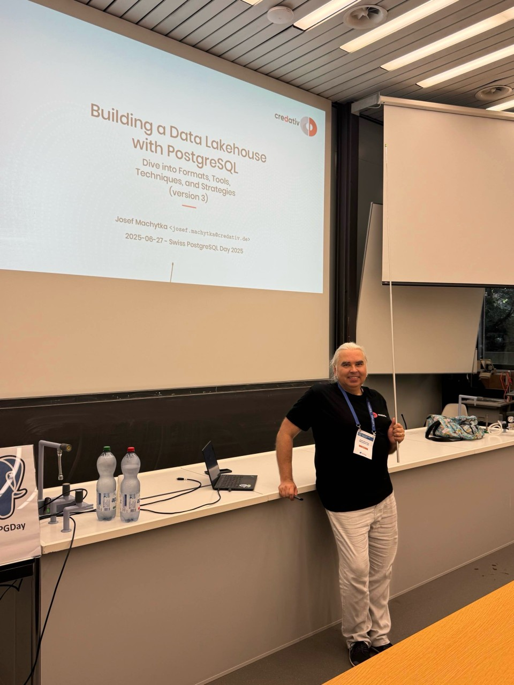
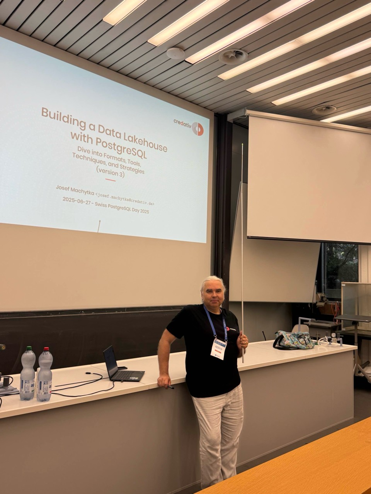
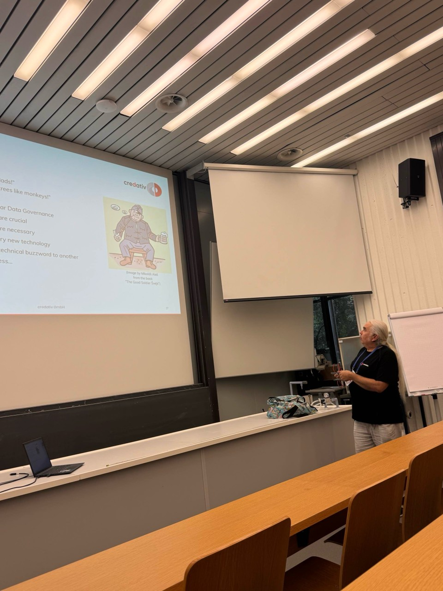
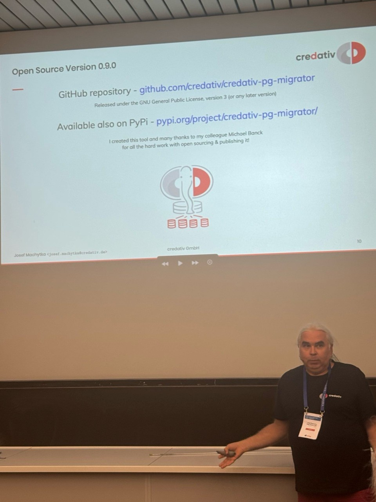
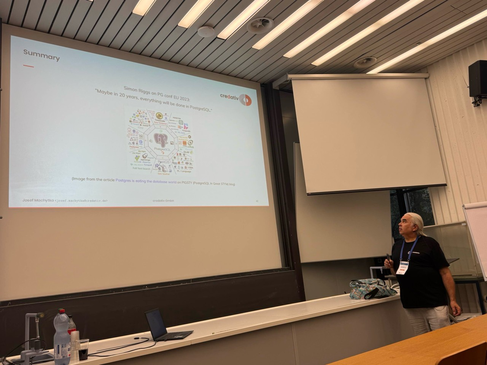

# Swiss PostgreSQL day 2025

https://www.pgday.ch/2025/#schedule

- Building a Data Lakehouse with PostgreSQL Dive into Formats, Tools, Techniques, and Strategies (version3)
- Boldly Migrate to PostgreSQL with credativ-pg-migrator - Use our new Open Source Tool - Your Data Deserves the Best

## Photos

